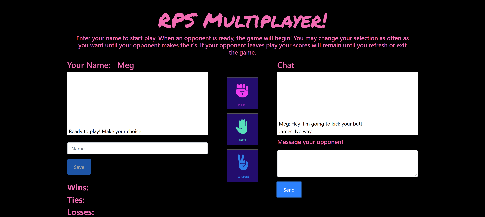

# Rock Paper Scissors - Multiplayer 
  

      
  
  ## Description  ✏️
  
  This is the traditional RPS game with the addition of scoring and real-time chat using the Firebase Real-time database. 

  Only two players may play one time. A player cannot play alone. 
  
  ## Table of Contents 📖
  
  [Installation](#installation)

  [Usage](#usage)

  

  [Issues](#known-issues)

  [Credits](#credits)

  [Questions](#questions)
  
  ## Installation 
  
Clone the repository and open the index.html in the browser of your choice.n 
  
  ## Usage 
  
  Enter your name (min 1 character) and hit save button. This will activate the buttons for play. When an opponent is available you will see "Ready to Play" in the game output box. Use the buttons for Rock, Paper, and Scissors to make your choice. You may change your choice as many times as you like until your opponent has made their's. You will see the results of the game in the game output box. Your scores will accumulate regardless of how many opponents you play until you exit or refresh. You may chat as you like with your opponent. Your chats will remain visible until you exit or refresh. Have fun!

  ### Deployed Link
  https://femke77.github.io/RPS-Multiplayer/

### Screenshots

______________________________________________________________________________________

## Known Issues 
NOT MOBILE RESPONSIVE

## Credits 
RPS game is not my creation.
Images are from Vecteezy under the free license.  
<a href="https://www.vecteezy.com/free-vector/rock-paper-scissors">Rock Paper Scissors Vectors by Vecteezy</a>

 ## Questions 
  
 If you have any questions about the repo or notice any bugs you want to report, open an issue or contact me directly at megan.meyers.388@gmail.com. 
  
  